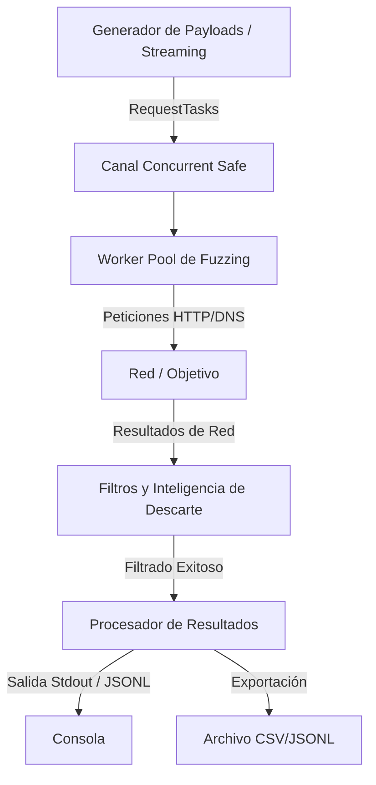

# FUzzer Xtreme - FUX (v4.3)

FUX (FUzzer Xtreme) es una herramienta de fuzzing modular, concurrente y de alto rendimiento escrita en Go, diseñada para auditorías de seguridad ofensivas y análisis de superficie de ataque. Permite descubrir directorios web, hosts virtuales (vhosts) y subdominios de forma extremadamente rápida, estable y eficiente en el uso de memoria RAM.

---

## 🚀 Características Principales

*   **Streaming Híbrido de Wordlists (Consumo Constante de RAM):** A diferencia de otros fuzzers tradicionales que cargan diccionarios completos en la memoria RAM (lo que causa caídas del sistema con archivos de varios gigabytes), Fux lee la wordlist principal (`FUZZ`) en flujo lineal a demanda (`O(1)` de complejidad de memoria). Esto permite usar diccionarios de más de 10 GB consumiendo menos de 30 MB de RAM.
*   **Modo Multi-Inyección (Cluster Bomb):** Permite inyectar múltiples diccionarios usando marcadores posicionales (`FUZZ`, `FUZ2Z`, `FUZ3Z`, `FUZ4Z`). Las listas secundarias se almacenan de manera eficiente para calcular el producto cartesiano sobre la marcha.
*   **Resiliencia y Concurrencia Avanzada:** Diseñado con un sistema robusto de canales concurrentes (`worker pool`), manejo seguro de señales de interrupción (`Ctrl+C`) que guarda el estado de la sesión, y mecanismos de recuperación ante pánicos (`panics`) de red.
*   **Detección de DNS Wildcards y Subdomain Takeovers:** En modo DNS, detecta automáticamente comodines de resolución y analiza registros CNAME para identificar posibles vulnerabilidades de secuestro de subdominios (*takeovers*).
*   **Evasión Inteligente (Smart Encode & WAF Bypass):** Mutación automática de payloads en caso de recibir respuestas `403 Forbidden` usando bypasses comunes de URL y cabeceras de origen simuladas.

---

## 🛠️ Modos de Operación

Fux cuenta con tres modos principales seleccionables a través de la flag `--mode`:

### 1. Modo Directorio (`dir`)
Es el modo por defecto. Fuzzea directorios, archivos y rutas en un servidor HTTP/S.
*   **Comportamiento:** Realiza peticiones HTTP y analiza códigos de estado, tamaños, palabras y líneas.
*   **Recursividad Inteligente (`-rec`):** Si encuentra un directorio (ej. redirección `301/302` con slash `/` al final), genera dinámicamente nuevas tareas de fuzzing dentro de ese subdirectorio de forma asíncrona hasta la profundidad indicada con `-md`.
*   **Evitación de Bucles Sin Salida (`isDeadEnd`):** Cuenta la cantidad de respuestas repetidas por directorio detectando si es una redirección infinita o un sumidero, deteniendo la recursión en esa rama si supera los 30 resultados idénticos para no atascar la ejecución.

### 2. Modo Host Virtual (`vhost`)
Utilizado para descubrir hosts virtuales apuntando a la misma dirección IP.
*   **Comportamiento:** Modifica la cabecera `Host` del paquete HTTP en cada petición (ej. `FUZZ.target.com`) manteniendo fija la dirección IP/Host de la URL destino.
*   **Bypass de CDN/WAF:** Si detecta discrepancias o posibles CNAME vulnerables, efectúa chequeos paralelos.

### 3. Modo DNS (`dns`)
Diseñado para el descubrimiento rápido de subdominios mediante resolución directa.
*   **Detección de Comodines (Wildcards):** Resuelve un subdominio aleatorio e inexistente antes de iniciar. Si este responde con IPs válidas, alerta al usuario que las resoluciones normales del diccionario generarán falsos positivos masivos.
*   **Validación de Takeover:** Mapea automáticamente los registros CNAME de los subdominios encontrados contra firmas de servicios vulnerables (AWS, Heroku, GitHub, Shopify, etc.).

---

## 🔬 Arquitectura y Mecánicas Internas

El motor de Fux está estructurado en base a las siguientes tuberías de datos (*pipelines*):



### 1. El Generador de Combinaciones (`generatePayloads`)
Al iniciar la ejecución, se lee la palabra de la wordlist principal línea por línea mediante un `bufio.Scanner`. Si se han definido diccionarios secundarios o extensiones (`-x`), se genera dinámicamente el producto cartesiano multiplicando los arreglos en caliente en lugar de pre-calcularlos en RAM.

### 2. Filtros Dinámicos e Inteligentes (`shouldDiscard`)
Fux procesa las respuestas utilizando un motor de filtrado por exclusión e inclusión:
*   **Filtros directos:** Filtrado de códigos de estado, número de palabras (`-fw`), líneas (`-fl`), y tamaño de cuerpo de respuesta (`-fs`).
*   **Rango de Tamaño:** Permite definir rangos como `-fs 100-200` para descartar respuestas con longitudes variables.
*   **Auto-Calibración (`-ac`):** Realiza 5 peticiones de prueba con rutas aleatorias al inicio. Almacena las firmas de respuesta (tamaño, líneas, palabras) de estas páginas "404 customizadas" y las descarta automáticamente durante el fuzzing para evitar falsos positivos.

### 3. Mutación y Evasión WAF (`SmartEncode`)
Si se activa `-se`, al recibir un código de estado `403 Forbidden`, la herramienta clona la tarea y reintenta de forma automática utilizando cabeceras de bypass de IP:
*   `X-Forwarded-For: 127.0.0.1`
*   `X-Real-IP: 127.0.0.1`
*   `Client-IP: 127.0.0.1`

Simultáneamente, muta la ruta HTTP del payload agregando sufijos de evasión de rutas como `/.`, `/..;/`, `/%2e/` o `/..%2f` para forzar la normalización incorrecta en el WAF/Proxy del objetivo.

---

## ⌨️ Compilación

Asegúrate de tener instalado [Go](https://go.dev/doc/install) (versión 1.20 o superior).

### Compilación Básica
```bash
go build -o fux fux.go
```

### Compilación Optimizada para Distribución (Tamaño Reducido)
Para stripping de símbolos del depurador y reducción de tamaño del binario final:
```bash
go build -ldflags="-s -w" -o fux fux.go
```

---

## 📖 Guía de Uso y Comandos Comunes

### Fuzzing de Directorios Web Estándar (5 Hilos por defecto)
```bash
./fux -u https://example.com/FUZZ -w wordlist.txt
```

### Búsqueda de Subdominios (Modo DNS)
Fuzzea el subdominio y utiliza un servidor DNS específico:
```bash
./fux -mode dns -u FUZZ.example.com -w subdomains.txt -r 1.1.1.1
```

### Fuzzing con Múltiples Wordlists (Modo Sniper/ClusterBomb)
```bash
./fux -u "http://target.com/FUZZ/FUZ2Z" -w dirs.txt -w files.txt
```

### Auto-Calibración de Falsos Positivos y Evasión WAF
```bash
./fux -u https://example.com/FUZZ -w wordlist.txt -ac -se -t 20
```

### Guardar Salida Completa en JSON Line (JSONL) sin colores de consola
```bash
./fux -u https://example.com/FUZZ -w wordlist.txt -oj -o resultados.json
```

---

## ⚙️ Parámetros y Banderas Disponibles

| Bandera | Tipo | Descripción | Default |
| :--- | :--- | :--- | :--- |
| `-u` | string | URL o dominio objetivo (Marcadores: `FUZZ`, `FUZ2Z`, etc.) | *Requerido* |
| `-w` | string | Wordlist local o generador especial (ej. `range:1-1000`) | *Requerido* |
| `-mode` | string | Modo de operación: `dir`, `vhost`, `dns` | `dir` |
| `-t` | int | Número de hilos concurrentes concurrentes | `5` |
| `-x` | string | Extensiones añadidas a los payloads (ej. `php,html,txt`) | `""` |
| `-ac` | bool | Activar Auto-Calibración inicial | `false` |
| `-se` | bool | Smart Encode (Mutación de bypass HTTP tras recibir 403) | `false` |
| `-ra` | bool | Rotar User-Agent de manera aleatoria por petición | `false` |
| `-follow`| bool | Seguir redirecciones HTTP (`3xx`) | `false` |
| `-rate` | int | Límite máximo de peticiones por segundo (`0` para ilimitado) | `0` |
| `-mc` | string | Matcher: mostrar solo códigos de estado específicos | `200,204,301,302,307,308...` |
| `-fc` | string | Filter: ocultar respuestas con estos códigos de estado | `404` |
| `-version`| bool | Muestra la versión actual de la herramienta | `false` |
| `-silent`| bool | Modo silencioso (solo imprime hallazgos exitosos) | `false` |
| `-res` | string | Ruta del archivo de sesión `.json` para reanudar el escaneo | `""` |
